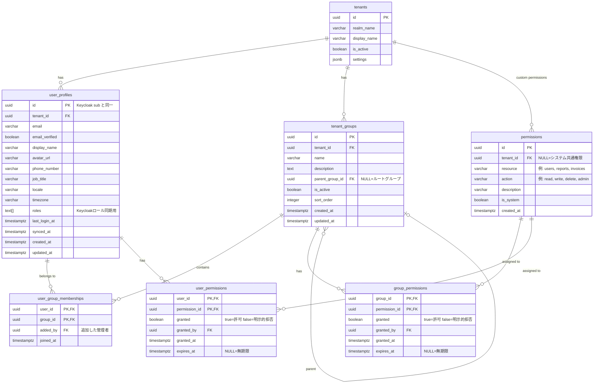

# ユーザープロフィール・グループ・権限設計

## 概要

SaaS向けの汎用的なユーザープロフィール・グループ管理・権限制御の設計。  
Keycloakのレルムロール（tenant_admin / user）とは独立した、**業務レベルの細粒度権限**を業務DBで管理する。

---

## 設計方針

| 方針 | 内容 |
|------|------|
| **認証と認可の分離** | 認証（ログイン/MFA）はKeycloak、細粒度権限は業務DB |
| **グループ = 部署** | テナント内の組織単位。ユーザーは複数グループに所属可能 |
| **権限の2層構造** | グループ権限（継承）＋ユーザー直接権限（上書き） |
| **明示的拒否** | `granted=false` で特定リソースへのアクセスを明示的に禁止可能 |
| **マルチテナント分離** | 全テーブルに `tenant_id` を持ち、RLSで行レベル分離 |
| **グループ階層** | `parent_group_id` により部署→チームの1階層のみサポート（無限ループ防止） |

---

## ER図



---

## 権限解決ルール

```
最終権限 = ユーザー直接権限（存在する場合） OR グループ権限の AND集計（全グループで許可なら許可）
```

優先度（高 → 低）:
1. **ユーザー直接権限（granted=false）** → 最強の拒否
2. **ユーザー直接権限（granted=true）** → 明示的許可
3. **グループ権限（いずれかのグループで granted=false）** → 拒否
4. **グループ権限（いずれかのグループで granted=true）** → 許可
5. **デフォルト** → 拒否

```sql
-- 権限チェッククエリ例（$user_id, $resource, $action）
WITH user_direct AS (
    SELECT up.granted
    FROM user_permissions up
    JOIN permissions p ON p.id = up.permission_id
    WHERE up.user_id = $user_id
      AND p.resource = $resource
      AND p.action   = $action
),
group_perms AS (
    SELECT gp.granted
    FROM user_group_memberships ugm
    JOIN group_permissions gp ON gp.group_id = ugm.group_id
    JOIN permissions p ON p.id = gp.permission_id
    WHERE ugm.user_id = $user_id
      AND p.resource  = $resource
      AND p.action    = $action
)
SELECT
    CASE
        -- ユーザー直接権限が存在すれば最優先
        WHEN EXISTS (SELECT 1 FROM user_direct) THEN
            (SELECT granted FROM user_direct LIMIT 1)
        -- グループ権限のいずれかが false なら拒否
        WHEN EXISTS (SELECT 1 FROM group_perms WHERE granted = false) THEN
            false
        -- グループ権限のいずれかが true なら許可
        WHEN EXISTS (SELECT 1 FROM group_perms WHERE granted = true) THEN
            true
        -- デフォルト拒否
        ELSE false
    END AS has_permission;
```

---

## テーブル定義

### user_profiles（拡張）

既存テーブルへの追加カラム：

| カラム | 型 | 説明 |
|--------|-----|------|
| `avatar_url` | VARCHAR(500) | プロフィール画像URL |
| `phone_number` | VARCHAR(50) | 電話番号 |
| `job_title` | VARCHAR(200) | 役職 |
| `locale` | VARCHAR(10) | ロケール（例: ja, en-US） |
| `timezone` | VARCHAR(50) | タイムゾーン（例: Asia/Tokyo） |
| `is_active` | BOOLEAN | アカウント有効フラグ |
| `deactivated_at` | TIMESTAMPTZ | 無効化日時 |
| `metadata` | JSONB | アプリ固有の拡張フィールド |

### tenant_groups

> **命名**: PostgreSQL の予約語 `groups` を避けるため `tenant_groups` を使用。

| カラム | 型 | 制約 | 説明 |
|--------|-----|------|------|
| `id` | UUID | PK | |
| `tenant_id` | UUID | FK→tenants | テナント分離 |
| `name` | VARCHAR(200) | NOT NULL | グループ名（例: 営業部、開発チーム） |
| `description` | TEXT | | 説明 |
| `parent_group_id` | UUID | FK→tenant_groups, NULL許可 | 親グループ（NULL=ルート） |
| `is_active` | BOOLEAN | DEFAULT TRUE | FALSE=論理削除 |
| `sort_order` | INTEGER | DEFAULT 0 | 表示順 |

> **制約**: `parent_group_id IS DISTINCT FROM id`（自己参照禁止 CHECK制約）。循環参照はアプリ層で防止。
> **UNIQUE**: アクティブなグループ内では `(tenant_id, name)` が一意（論理削除済みは除外する部分インデックス）。

### permissions

| カラム | 型 | 説明 |
|--------|-----|------|
| `resource` | VARCHAR(100) | リソース名（例: `users`, `reports`, `billing`, `settings`） |
| `action` | VARCHAR(50) | アクション（`read`, `write`, `delete`, `admin`, `export`） |
| `tenant_id` | UUID, NULL | NULLの場合はシステム共通権限 |
| `is_system` | BOOLEAN | システム定義権限（削除不可）。`is_system=TRUE` のとき `tenant_id` は必ず NULL（スプーフィング防止 CHECK制約） |

推奨システム権限プリセット：

| resource | action | 説明 |
|----------|--------|------|
| `users` | `read` | ユーザー一覧・詳細参照 |
| `users` | `write` | ユーザー作成・編集 |
| `users` | `delete` | ユーザー削除 |
| `users` | `admin` | MFA, パスワードリセット操作 |
| `groups` | `read` | グループ参照 |
| `groups` | `write` | グループ作成・編集 |
| `groups` | `admin` | メンバー管理 |
| `reports` | `read` | レポート参照 |
| `reports` | `export` | エクスポート |
| `billing` | `read` | 請求情報参照 |
| `billing` | `admin` | 請求設定変更 |
| `settings` | `read` | テナント設定参照 |
| `settings` | `write` | テナント設定変更 |

---

## Keycloakロールとの役割分担

```
Keycloak Realm Roles          業務DB permissions
─────────────────────         ─────────────────────────────────────
super_admin    ────────────→  全テナント・全権限（システム管理者）
tenant_admin   ────────────→  自テナントの全グループ・全権限（初期値）
user           ────────────→  デフォルト: 付与なし（グループ設定に従う）
```

- **Keycloakロール**：誰がこのテナントの管理者か（認証・粗粒度）
- **業務DB permissions**：具体的に何のリソースを操作できるか（認可・細粒度）

---

## RLS設計

全新規テーブルに同じパターンを適用：

```sql
ALTER TABLE tenant_groups           ENABLE ROW LEVEL SECURITY;
ALTER TABLE user_group_memberships  ENABLE ROW LEVEL SECURITY;
ALTER TABLE permissions             ENABLE ROW LEVEL SECURITY;
ALTER TABLE group_permissions       ENABLE ROW LEVEL SECURITY;
ALTER TABLE user_permissions        ENABLE ROW LEVEL SECURITY;

-- tenant_groups のポリシー例（他テーブルも同様）
-- NULLIF で空文字を NULL に変換し、未設定時のキャスト失敗を防ぐ
CREATE POLICY tenant_isolation ON tenant_groups
    USING (tenant_id = NULLIF(current_setting('app.current_tenant_id', true), '')::UUID);
```

---

## 実装上の注意事項

1. **Keycloak側のグループと同期するか？**  
   Keycloakにもグループ機能があるが、今回は業務DBで独立管理する。  
   理由：細粒度の権限ロジックをKeycloakに持たせると移植性が下がるため（ADR 003方針）。

2. **グループ権限の集計パフォーマンス**  
   `user_group_memberships` + `group_permissions` の結合はユーザーのグループ数が増えると重くなる。  
   Active Userのグループ権限を Redis に TTL 5分でキャッシュすることを推奨。

3. **テナント管理者の初期権限**  
   新規テナント作成時に `tenant_admin` ユーザーへ全システム権限を自動付与するセットアップスクリプトを用意する。

4. **カスタム権限**  
   アプリ独自のリソース（例: `invoice`, `crm_contact`）は `tenant_id` を指定した permissions レコードとして追加する。
